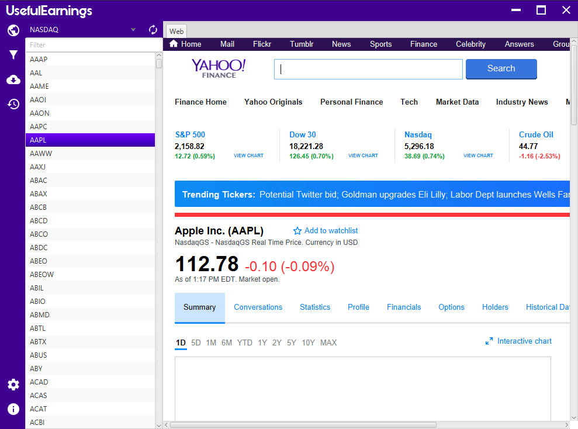
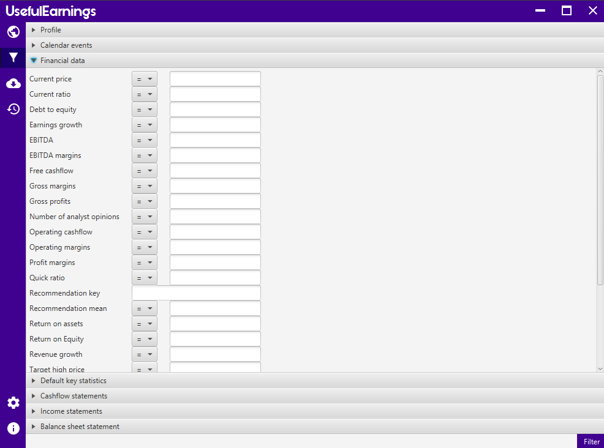
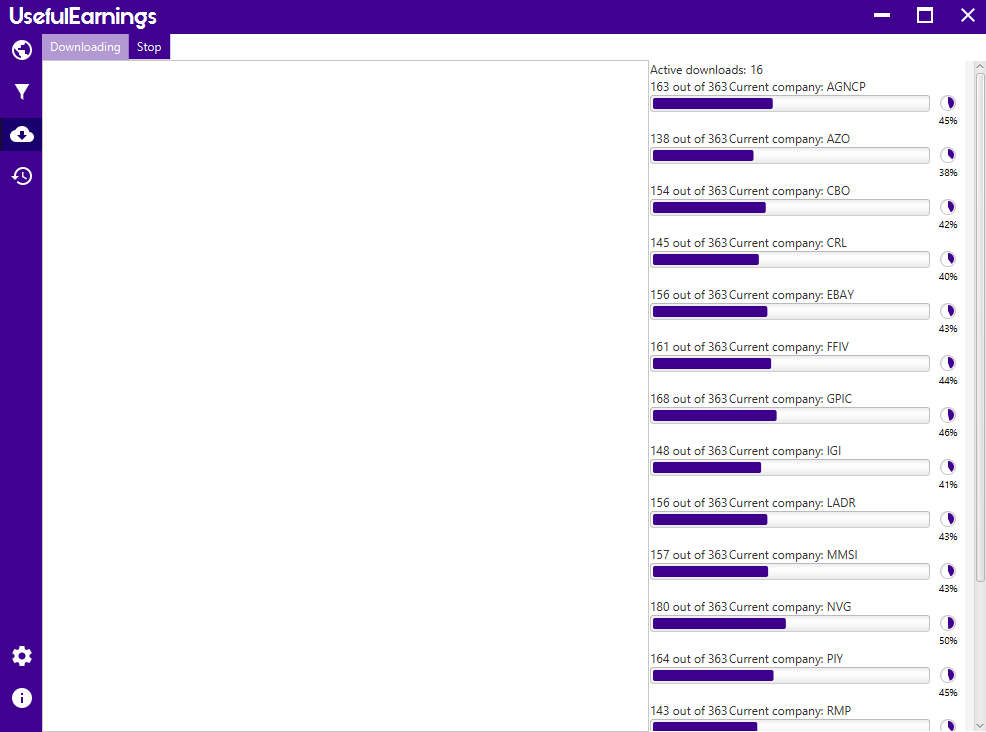

# UsefulEarnings

# New version under development!

Desktop application that provides financial data from the Yahoo! Finance API and filters on data

* Main view, ability to browse Yahoo Finance's companies clicking on company's symbols!

* Filtering conditions

* Use the power of your processor's cores to improve the data download!

